# OwO-Blinkathon
 OwO Rapyd

- [OwO-Blinkathon](#owo-blinkathon)
- [OwO Getting Started:](#owo-getting-started)

# OwO Getting Started:

Note: Check your spam folders if you are using our email service.

Webpage
https://main.d1v7l1x8vxa5jf.amplifyapp.com/

In order to start using the platform, we have already created a parent account and a child account for you so that you can quickly review the characteristics mentioned in the readme, however feel free to create your own accounts, the registration is 100% functional.

Also if you put a real email, you will receive an email like the one shown in the README.

Access keys:

Parent:

Email: blink@blinkathon.com

Pass: toor

Kid:

Email: blinkjr@blinkathon.com

Pass: toor

- Click login.

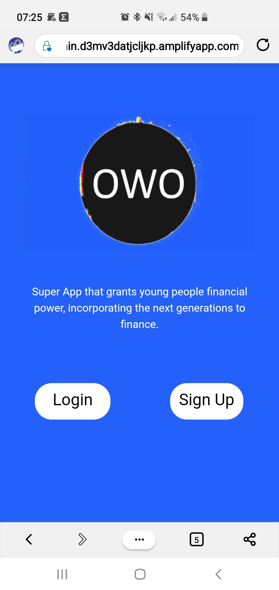

- Login with the parent account:

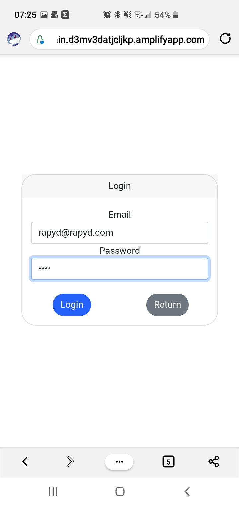

- Check that your transactions are in order

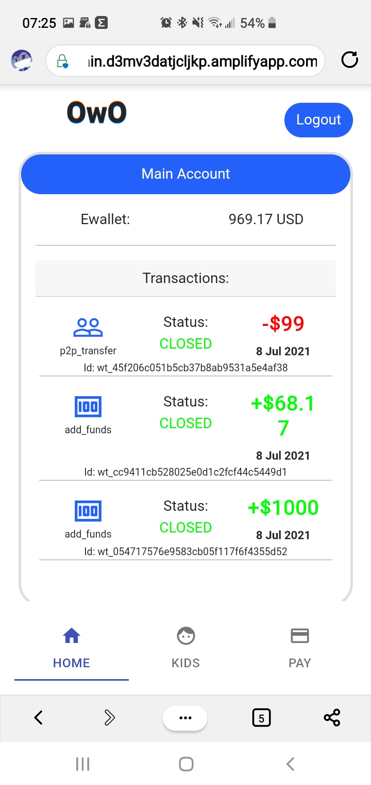

- Solana's SOLs are quite high today, it is time to sell some.

- For prototype purposes only, charge any dollar amount.

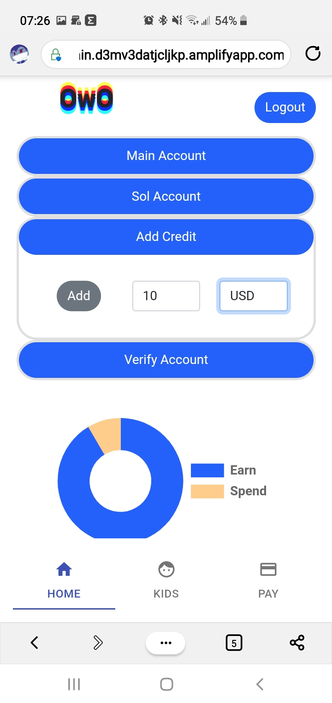

- Due to devnet rules it is only possible to load SOLs 10 by 10s.

- Check that your child is saving his money even and has not spent it on video games.

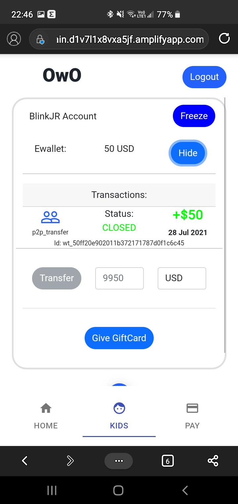

- Como nuestro hijo a ahorrado su dinero le daremos una GiftCard 
  
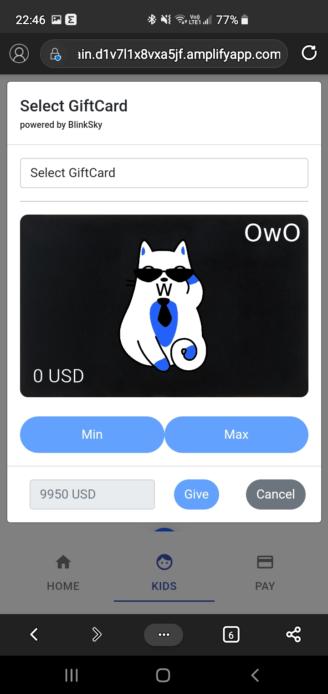

- Seleccionemos una de amazon para que pida ese control nuevo que tanto queria.

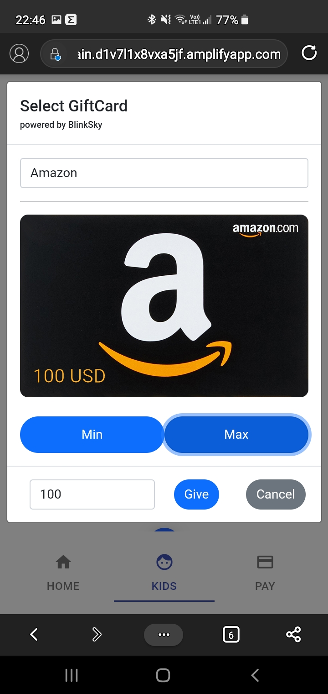

- Si vemos en las trasacciones podremos ver que ya cobraron la tarjeta de nuestro saldo.
 
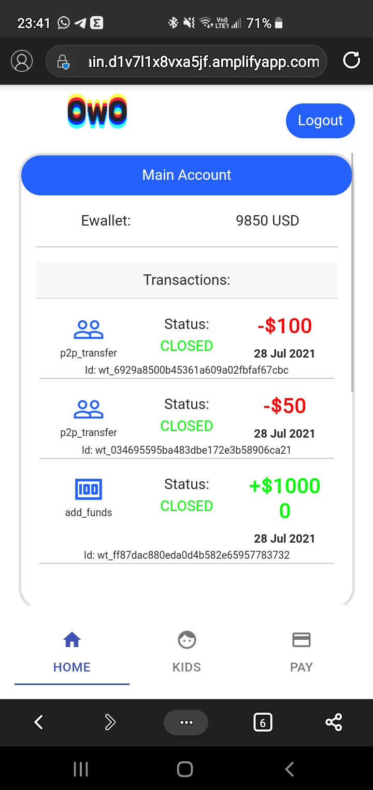

- Oh it seems that you forgot to issue your card is a good time to do it.

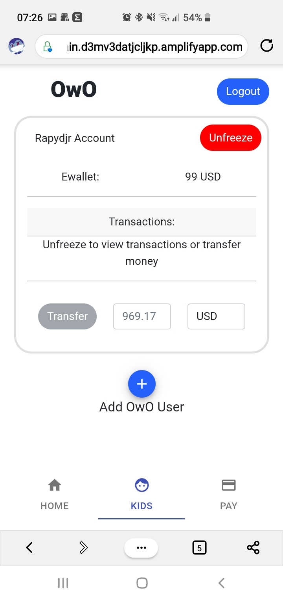

- Now that we are done looking at the father's account, let's look at the son's account.

Email: blinkjr@blinkathon.com

Pass: toor

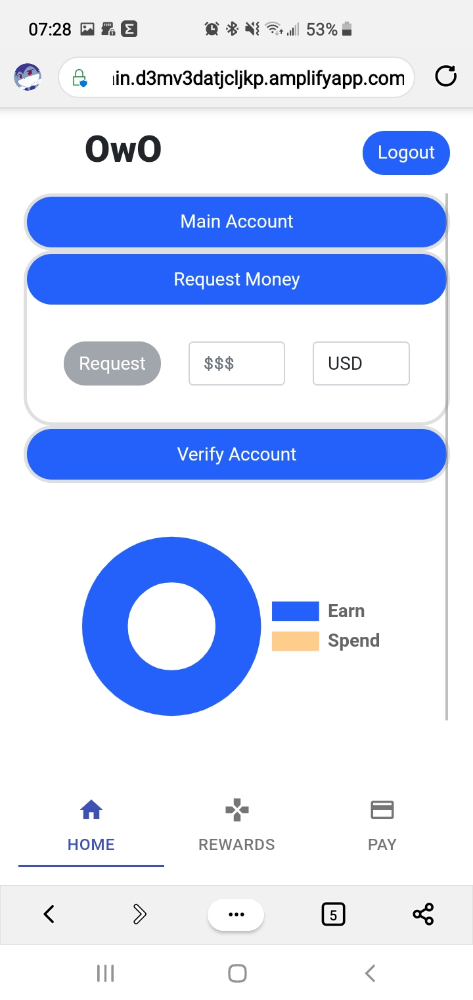

- Ahora en la pestaña de rewards podremos ver la tarjeta que le dimos a nuestro hijo.

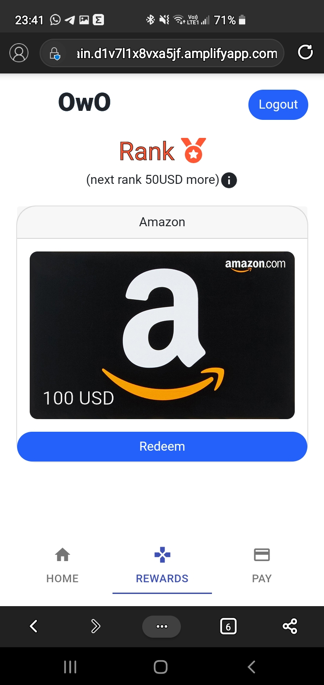

- Si le damos clic podemos ver que es una tarjeta real (sandbox) de blinksky.

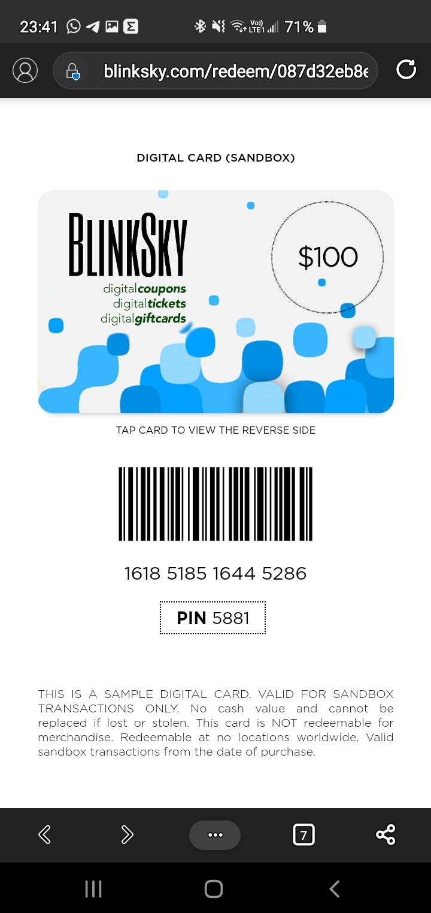