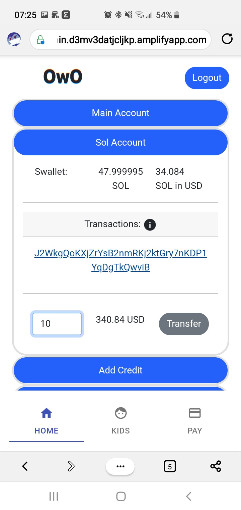

# OwO-Rapyd
 OwO Rapyd

- [OwO-Rapyd](#owo-rapyd)
- [OwO Getting Started:](#owo-getting-started)

# OwO Getting Started:

Note: Check your spam folders if you are using our email service.

Webpage
https://main.d3mv3datjcljkp.amplifyapp.com/

In order to start using the platform, we have already created a parent account and a child account for you so that you can quickly review the characteristics mentioned in the readme, however feel free to create your own accounts, the registration is 100% functional.

Also if you put a real email, you will receive an email like the one shown in the README.

Access keys:

Parent:

Email: rapyd@rapyd.com

Pass: toor

Kid:

Email: rapydjr@rapyd.com

Pass: Toor

- Click login.

- Login with the parent account:

- Check that your transactions are in order

- Solana's SOLs are quite high today, it is time to sell some.

- For prototype purposes only, charge any dollar amount.

- Due to devnet rules it is only possible to load SOLs 10 by 10s.

- Check that your child is saving his money even and has not spent it on video games.

- Oh it seems that you forgot to issue your card is a good time to do it.

- Now that we are done looking at the father's account, let's look at the son's account.

Email: rapydjr@rapyd.com

Pass: Toor

- How good, we are one dollar from the silver level,
  

- Let's ask Dad for some to improve my coupons a bit.

